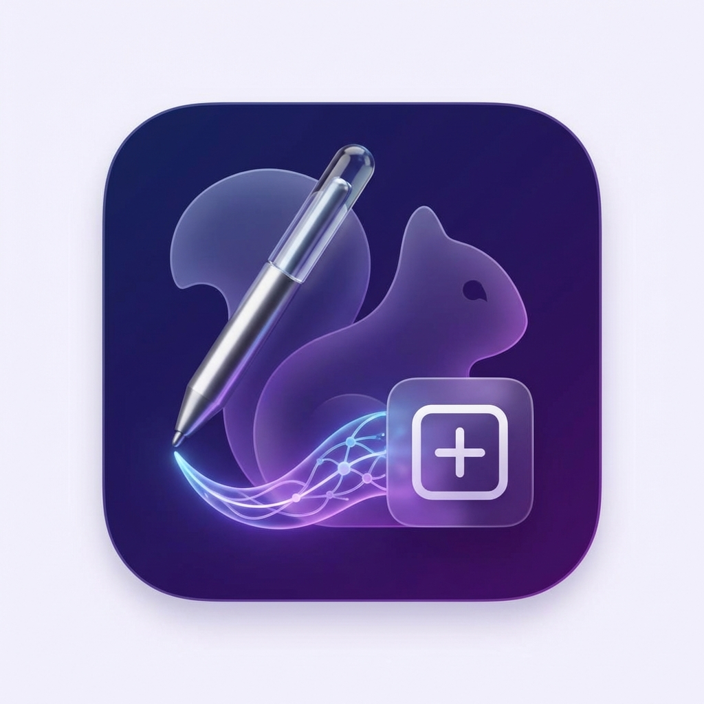
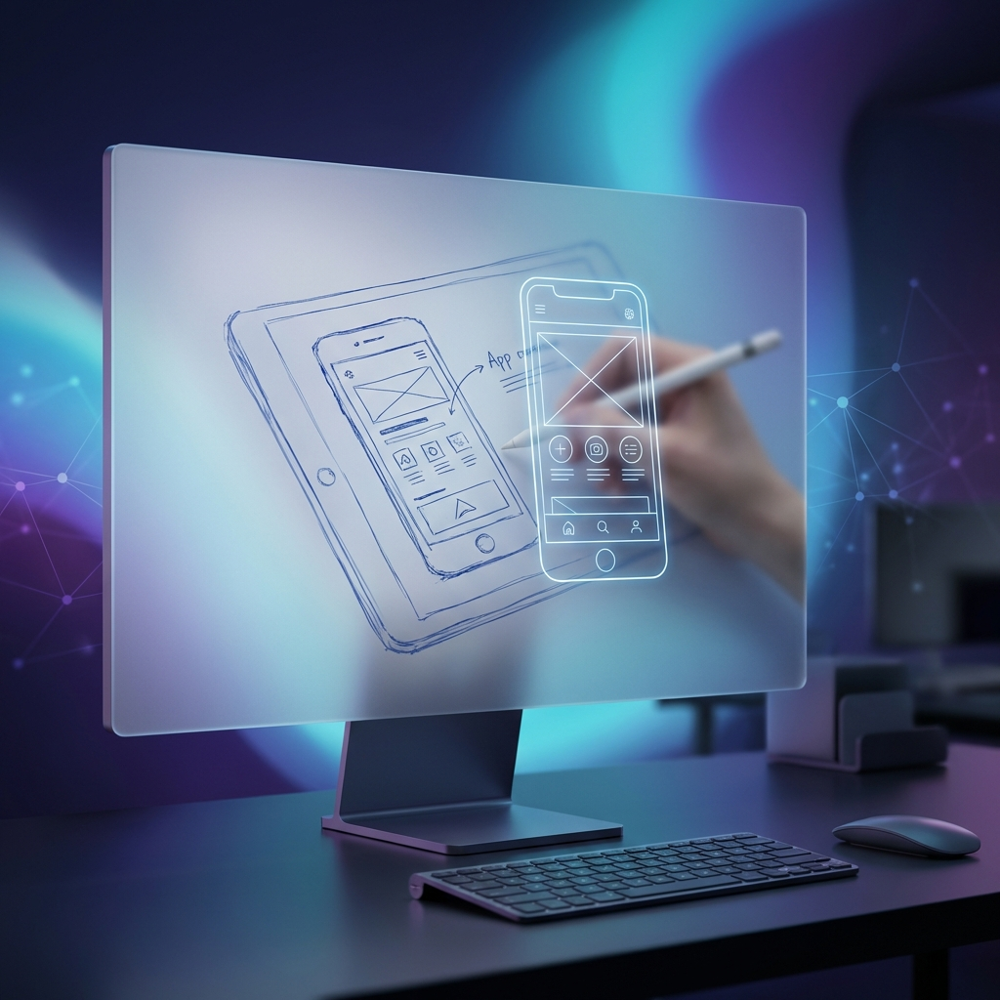

#  NeuralCanvas



## 🎯 Vision

**NeuralCanvas** is a privacy-first macOS design tool that empowers developers and designers to transform rough hand-drawn sketches into polished UI wireframes instantly. By leveraging on-device machine learning, we eliminate the gap between ideation and implementation while keeping your intellectual property entirely local.

---

## ❓ The Problem

Designers and developers often waste hours manually converting whiteboard sketches or notebook drawings into digital wireframes. Existing cloud-based solutions risk exposing sensitive IP and often produce low-quality results that require extensive manual correction.

## ✨ Key Features

### 🧠 Intelligent Sketch Recognition

Draw freely using your mouse, trackpad, or Apple Pencil. NeuralCanvas uses **CoreML** and the **Apple Neural Engine** to recognize UI elements—buttons, text fields, cards, and more—converting them into crisp vector shapes in real-time.

### 🖼️ Style Mirror

Inspired by modern design systems, **Style Mirror** allows you to import screenshots of existing apps. NeuralCanvas automatically extracts color palettes, typography scales, spacing systems, and corner radii, applying them to your wireframe with a single click.

### 🔒 Privacy by Design

Everything happens on your Mac. No network calls, no cloud processing, and no data collection. NeuralCanvas is built on a local-first architecture using **SwiftData**, ensuring your creative process remains completely private.

### ⚡ Professional Export

Move from concept to collaboration effortlessly. Export your wireframes in industry-standard formats:

- **SVG** (Scalable Vector Graphics)
- **PDF** (High-quality documentation)
- **PNG/JPEG** (Instant sharing)

---

## 🛠️ Technical Stack

NeuralCanvas is a native macOS application built for the future of Apple Silicon:

- **Framework:** SwiftUI 6 (.ultraThinMaterial, PhaseAnimator)
- **Intelligence:** CoreML & Vision Framework (Optimized for M4)
- **Persistence:** SwiftData
- **Graphics:** Metal & MetalKit (60fps canvas rendering)
- **OS Requirement:** macOS 15+ (Sequoia)

---

## 🚀 Getting Started

### Prerequisites

- Apple Silicon Mac (M1, M2, M3, or M4)
- macOS 15 or later
- Xcode 16+ (for development)

### Installation

1. Clone the repository:

   ```bash
   git clone https://github.com/salvadalba/nodaysidle-neuralcanvas.git
   ```

2. Open `NeuralCanvas.xcodeproj` in Xcode.
3. Build and run the project (`⌘R`).

---

## 📊 Success Metrics

- **Speed:** Sketch-to-wireframe conversion under 500ms.
- **Accuracy:** Over 95% recognition rate for standard UI components.
- **Privacy:** 100% on-device processing.

---

## 🤝 Contributing

We welcome contributions from the community! Whether you're fixing a bug, adding a feature, or improving documentation, please feel free to open a Pull Request.

---

## 📄 License

This project is licensed under the MIT License - see the [LICENSE](LICENSE) file for details.

---

<p align="center">
  Built with privacy in mind, NDI style.
</p>
